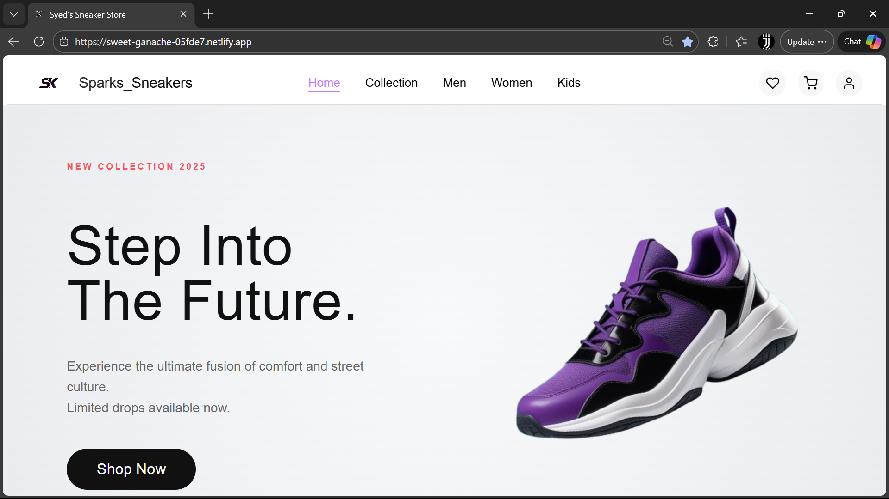
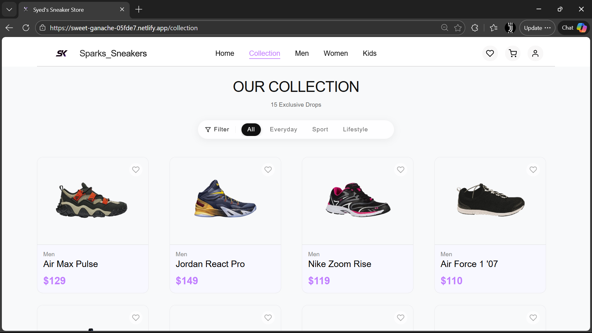
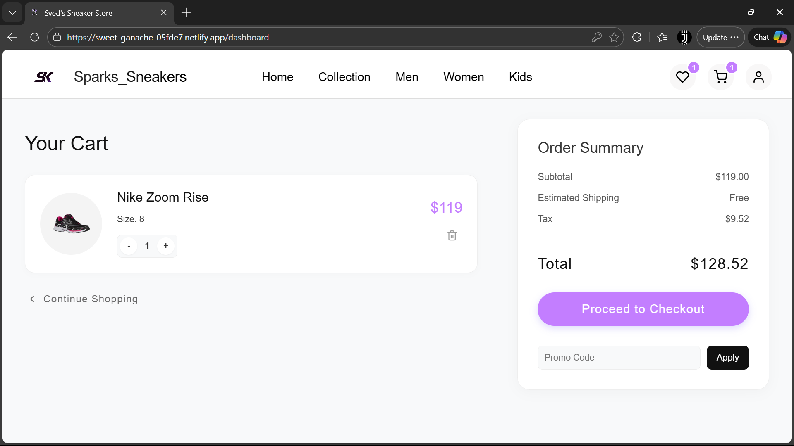
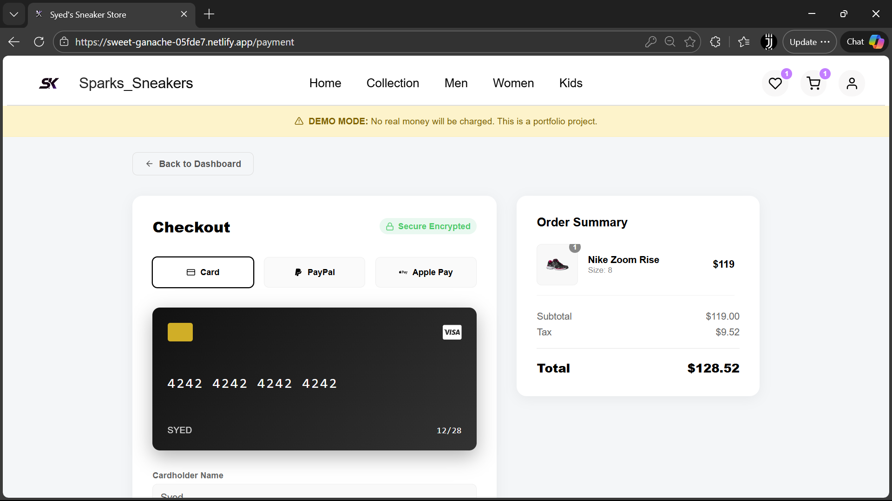
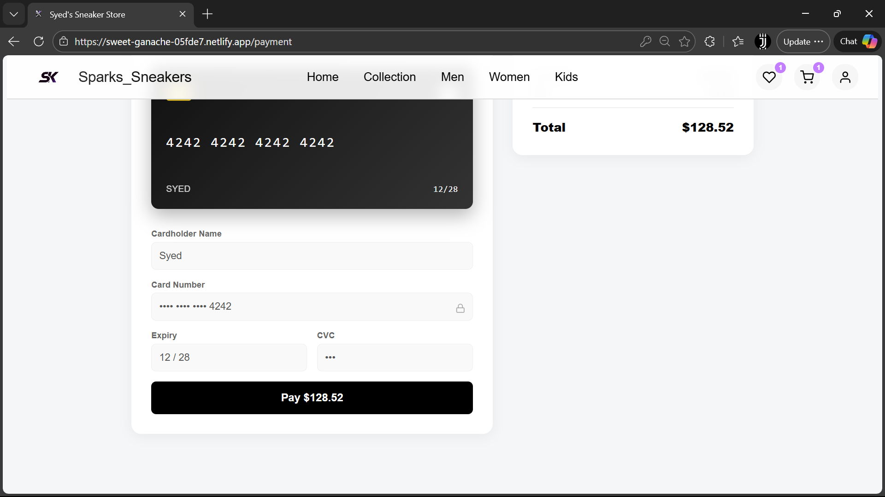
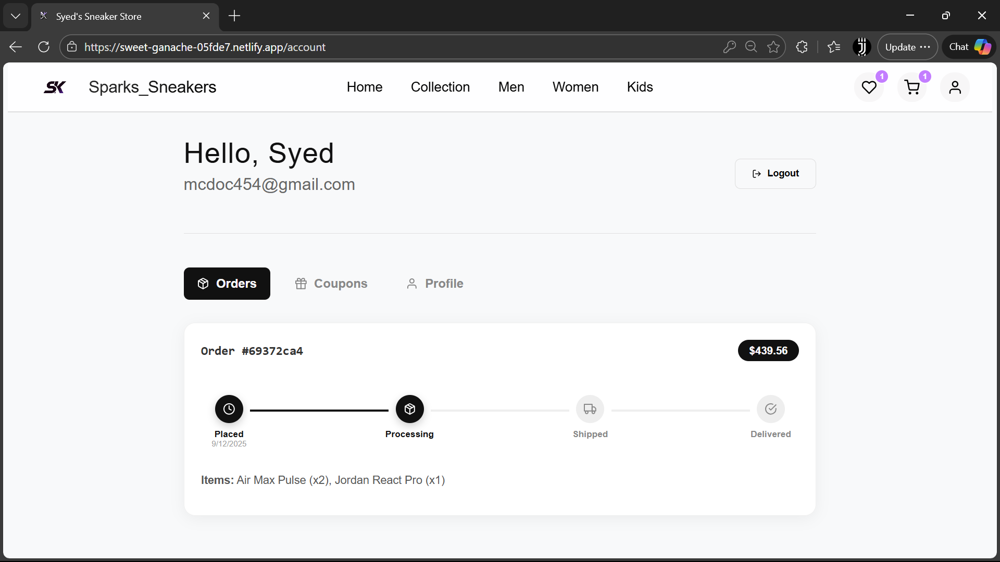
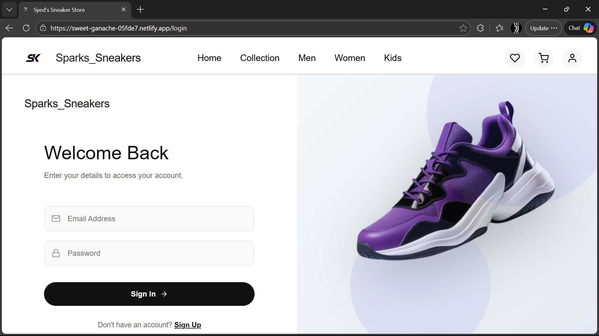
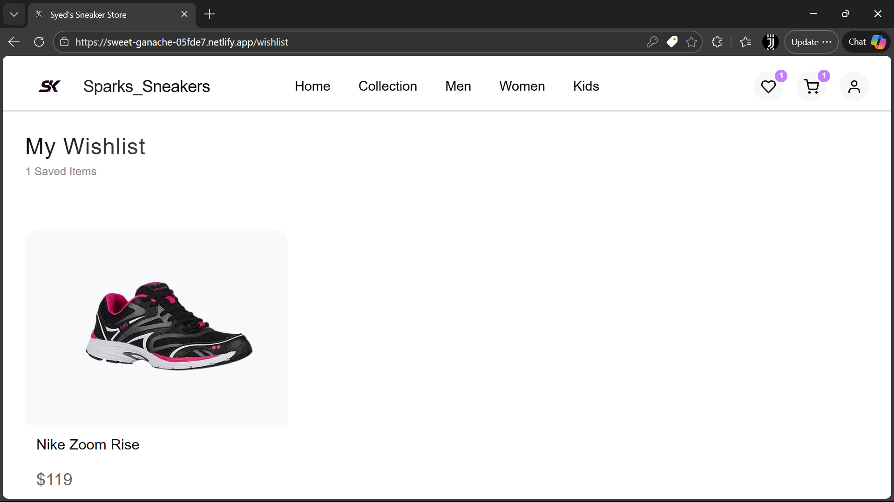

# Sparks_Sneakers 👟
> *Step Into Style – The Ultimate Sneaker Shopping Experience.*

[](https://sweet-ganache-05fde7.netlify.app)
[](https://github.com/Syed9514/Sparks_Sneaker_Project.git)

**Sparks_Sneakers** is a modern, full-stack e-commerce platform built to provide a seamless and engaging shopping experience for sneaker enthusiasts. Combining a high-performance React frontend with a robust Node.js backend, it offers dynamic product showcases, secure authentication, and smooth animations.

---

## 📑 Table of Contents
- [Features](#-features)
- [Tech Stack](#-tech-stack)
- [Project Structure](#-project-structure)
- [Screenshots](#-screenshots)
- [Installation & Setup](#-installation--setup)
- [Usage](#-usage)
- [Future Enhancements](#-future-enhancements)
- [Contributing](#-contributing)
- [License](#-license)
- [Author](#-author)

---

## 🚀 Features

### 🛒 E-Commerce Functionality
- **Product Browsing**: Filter and browse sneakers by category (Men, Women, Kids) and collections.
- **Interactive Cart**: Add, remove, and manage items in the shopping cart with real-time price updates.
- **Wishlist**: Save favorite items for later.
- **Secure Checkout**: Streamlined checkout process for order placement.

### 🔐 User Experience & Security
- **Authentication**: Secure user login and registration using **JWT (JSON Web Tokens)** and **Bcrypt**.
- **Responsive Design**: Fully optimized for desktop, tablet, and mobile devices.
- **Dynamic Animations**: Smooth transitions and effects powered by **Framer Motion** and **GSAP**.
- **Admin Management**: (Optional) Backend support for product and order management.

---

## 🛠 Tech Stack

### **Frontend (Client)**
- **Framework**: [React.js](https://reactjs.org/) (v18)
- **State Management**: [Redux Toolkit](https://redux-toolkit.js.org/)
- **Routing**: [React Router DOM](https://reactrouter.com/)
- **Styling**: [Styled Components](https://styled-components.com/)
- **Animations**: [Framer Motion](https://www.framer.com/motion/), [GSAP](https://greensock.com/gsap/)
- **HTTP/Networking**: [Axios](https://axios-http.com/)

### **Backend (Server)**
- **Runtime**: [Node.js](https://nodejs.org/)
- **Framework**: [Express.js](https://expressjs.com/)
- **Database**: [MongoDB](https://www.mongodb.com/) (with Mongoose)
- **Authentication**: JWT, BcryptJS
- **File Handling**: Multer
- **Environment**: Dotenv

---

## 📂 Project Structure

```bash
Sparks_Sneakers/
├── sneak-frontend/      # React.js Frontend Application
├── sneak-backend/       # Node.js/Express Backend API
├── screenshots/         # Project Screenshots and Assets
└── README.md            # Project Documentation
```

---

## 📸 Screenshots

### **Home Page**


### **Product Collection**


### **Shopping Cart**


### **Checkout**



### **Account**


### **Login**


### **Wishlist**


---

## ⚡ Installation & Setup

Follow these steps to run the project locally.

### **Prerequisites**
- **Node.js**: v14+ installed
- **MongoDB**: Local or Atlas connection string

### **1. Backend Setup**
```bash
# Navigate to backend directory
cd sneak-backend

# Install dependencies
npm install

# Configure Environment Variables
# Create a .env file in the root of sneak-backend and add:
# PORT=5000
# MONGO_URI=your_mongodb_connection_string
# JWT_SECRET=your_jwt_secret

# Start the server
npm run dev
```

### **2. Frontend Setup**
```bash
# Navigate to frontend directory
cd sneak-frontend

# Install dependencies
npm install

# Start the development server
npm start
```

*The frontend will typically run at `http://localhost:3000` and the backend at `http://localhost:5000`.*

---

## 🖱 Usage

1.  **Register/Login**: Create an account to manage your cart and orders.
2.  **Explore**: Browse the "Men", "Women", or "Collection" sections to find sneakers.
3.  **Cart**: Click "Add to Cart" on items you like. View your cart to adjust quantities.
4.  **Checkout**: Proceed to checkout to finalize your mock purchase.

---

## 🔮 Future Enhancements

- [ ] **Payment Gateway Integration**: Stripe or PayPal integration for real transactions.
- [ ] **User Profile Dashboard**: View order history and update profile details.
- [ ] **Review System**: Allow users to rate and review products.
- [ ] **Dark Mode**: Toggle between light and dark themes.

---

## 🤝 Contributing

Contributions are welcome! Please follow these steps:
1.  Fork the repository.
2.  Create a new branch (`git checkout -b feature/YourFeature`).
3.  Commit your changes (`git commit -m 'Add some feature'`).
4.  Push to the branch (`git push origin feature/YourFeature`).
5.  Open a Pull Request.

---

## 📝 License

This project is licensed under the **MIT License**.

---

## 👨‍💻 Author

**Syed Kalam**
- **GitHub**: [Syed9514](https://github.com/Syed9514)
- **LinkedIn**: [Syed Kalam](https://www.linkedin.com/in/syed-kalam-590407270)

---

*Made with ❤️ by Syed Kalam*
